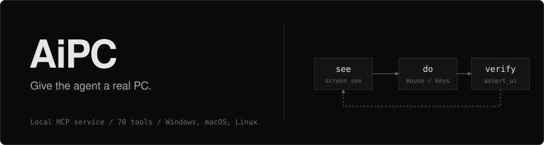

<br>

# SYSIK

Разработчик. Делаю инструменты, которые дают ИИ-агентам рабочий доступ к настоящему компьютеру.


<table>
<tr>
<td width="64"></td>
<td><b>Работаю над</b><br>Новыми проектами</td>
<td width="64"></td>
<td><b>Изучаю</b><br>Новые технологии</td>
<td width="64"></td>
<td><b>Открыт к</b><br>Сотрудничеству</td>
</tr>
<tr>
<td></td>
<td><b>Спроси меня</b><br>О чём угодно</td>
<td></td>
<td><b>Фан-факт</b><br>Just me</td>
<td></td>
<td><b>Связаться</b><br>Ссылки ниже</td>
</tr>
</table>


## Стек

       

---

## Что я делаю

Инструменты, с которыми ИИ-агенты выполняют реальную работу на реальном компьютере. Локально, на открытых стандартах: агент смотрит на экран, действует и проверяет каждый шаг.

| Направление   | Что это                                                 |
| ------------- | ------------------------------------------------------- |
| Agent tooling | MCP-серверы, нативные вызовы инструментов, ошибки       |
| Automation    | Экран, мышь, клавиатура, браузер, файлы, терминал, SSH  |
| Safety        | Режимы `ask` / `auto` / `read-only` на стороне сервера  |
| Open source   | MIT, разработка в открытую                              |

---

## AiPC

[](https://github.com/SysikNagibator/AiPC)

  

**AiPC** — локальный сервис и консольная утилита, которая даёт любому ИИ-агенту полный доступ к компьютеру по открытому стандарту **MCP** (Model Context Protocol). Агент перестаёт быть «текстом в чате» и работает как человек за ПК.

| Обычные ограничения агента | С AiPC                                                        |
| -------------------------- | ------------------------------------------------------------- |
| Нет экрана                 | `screen_see` — скриншот как нативный image-блок               |
| Клики наугад               | `ui_snapshot` / `ui_find` — готовые координаты                |
| Печать в пустоту           | `focus_type` — проверенный фокус, не печатает вслепую         |
| Спит и надеется            | `wait_for_window` / `wait_for_ui_element` / `wait_for_change` |
| Сработало ли — неизвестно  | `screenshot_diff`, `assert_ui`, `audit.log`                   |
| Нет доступа к машине       | Файлы, терминал, процессы, SSH/SFTP, браузер, буфер обмена    |

[Полный README](https://github.com/SysikNagibator/AiPC#readme) · [Релизы](https://github.com/SysikNagibator/AiPC/releases) · [Changelog](https://github.com/SysikNagibator/AiPC/blob/main/CHANGELOG.md)

```
[ Агент в любой IDE ] --MCP/stdio--> [ AiPC-Core: один локальный сервис ]
                                              |
          +------------------+----------------+------------------+
          |                  |                |                  |
        Vision            Control          Browser           System/Net
     скриншоты,         мышь+клавиши,     ваш Chrome      файлы, терминал,
     дерево UI,         приложения,       через CDP,      процессы, SSH,
     окна               буфер обмена      JS eval         поиск, sysinfo
```

Цикл агента: **see (`screen_see`) → do → re-see для проверки.**

> AiPC предназначен для личной автоматизации и тестирования на вашей машине. Не используйте для несанкционированного доступа.


## Статистика

 


## Контакты

[](https://t.me/sysgood) [](https://github.com/SysikNagibator)


