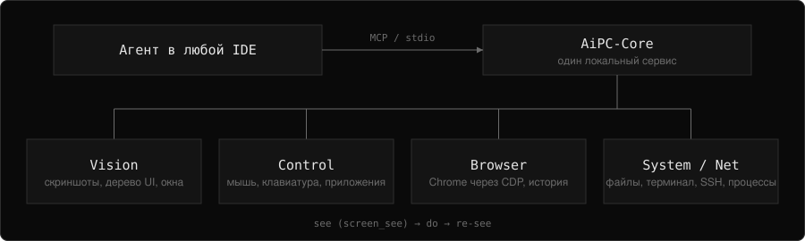

<h1>SYSIK</h1>

Разработчик. Делаю инструменты, которые дают ИИ-агентам рабочий доступ к настоящему компьютеру.

<table align="center">
<tr>
<td align="center" width="200"> <b>Работаю над</b> Новыми проектами</td>
<td align="center" width="200"> <b>Изучаю</b> Новые технологии</td>
<td align="center" width="200"> <b>Открыт к</b> Сотрудничеству</td>
</tr>
<tr>
<td align="center"> <b>Спроси меня</b> О чём угодно</td>
<td align="center"> <b>Фан-факт</b> Just me</td>
<td align="center"> <b>Связаться</b> Ссылки ниже</td>
</tr>
</table>

<h2>Стек</h2>

       

<h2>Что я делаю</h2>

Инструменты, с которыми ИИ-агенты выполняют реальную работу на реальном компьютере. Локально, на открытых стандартах: агент смотрит на экран, действует и проверяет каждый шаг.

<table align="center">
<tr><th align="center">Направление</th><th align="center">Что это</th></tr>
<tr><td align="center">Agent tooling</td><td align="center">MCP-серверы, нативные вызовы инструментов, структурированные ошибки</td></tr>
<tr><td align="center">Automation</td><td align="center">Экран, мышь, клавиатура, браузер, файлы, терминал, SSH</td></tr>
<tr><td align="center">Safety</td><td align="center">Режимы <code>ask</code> / <code>auto</code> / <code>read-only</code> на стороне сервера</td></tr>
<tr><td align="center">Open source</td><td align="center">MIT, разработка в открытую</td></tr>
</table>

<h2>AiPC</h2>

  

<b>AiPC</b> — локальный сервис и консольная утилита, которая даёт любому ИИ-агенту полный доступ к компьютеру по открытому стандарту <b>MCP</b> (Model Context Protocol). Агент перестаёт быть «текстом в чате» и работает как человек за ПК.

<table align="center">
<tr><th align="center">Обычные ограничения агента</th><th align="center">С AiPC</th></tr>
<tr><td align="center">Нет экрана</td><td align="center"><code>screen_see</code> — скриншот как нативный image-блок</td></tr>
<tr><td align="center">Клики наугад</td><td align="center"><code>ui_snapshot</code> / <code>ui_find</code> — готовые координаты</td></tr>
<tr><td align="center">Печать в пустоту</td><td align="center"><code>focus_type</code> — проверенный фокус, не печатает вслепую</td></tr>
<tr><td align="center">Спит и надеется</td><td align="center"><code>wait_for_window</code> / <code>wait_for_ui_element</code> / <code>wait_for_change</code></td></tr>
<tr><td align="center">Сработало ли — неизвестно</td><td align="center"><code>screenshot_diff</code>, <code>assert_ui</code>, <code>audit.log</code></td></tr>
<tr><td align="center">Нет доступа к машине</td><td align="center">Файлы, терминал, процессы, SSH/SFTP, браузер, буфер обмена</td></tr>
</table>

<a href="https://github.com/SysikNagibator/AiPC#readme">Полный README</a> · <a href="https://github.com/SysikNagibator/AiPC/releases">Релизы</a> · <a href="https://github.com/SysikNagibator/AiPC/blob/main/CHANGELOG.md">Changelog</a>

AiPC предназначен для личной автоматизации и тестирования на вашей машине. Не используйте для несанкционированного доступа.

<h2>Статистика</h2>

 

<h2>Контакты</h2>

 

